# STM32 开发指南 - 使用 VS Code 开发 STM32

> 原文来源：@Jayant | 图片来源：知乎 @Jayant  
> 本文档提供了在 VS Code 环境下开发 STM32 项目的完整指南

---

## 📑 目录

- [前期准备](#前期准备)
- [完整开发流程](#完整开发流程)
- [详细配置步骤](#详细配置步骤)
  - [1. 使用 STM32CubeMX 创建工程](#1-使用-stm32cubemx-创建工程)
  - [2. 配置 VS Code](#2-配置-vs-code)
  - [3. 配置调试功能](#3-配置调试功能)
- [项目结构说明](#项目结构说明)
- [开发文档](#开发文档)
- [常见问题](#常见问题)
- [快速参考](#快速参考)

---

## 前期准备

### ⚠️ 重要提示

**路径都最好不要有中文**，避免编译和调试时出现路径相关错误。

### 🔧 必需工具/环境

| 工具 | 说明 | 下载地址 |
|------|------|----------|
| **STM32CubeMX** | STM32 项目配置工具 | [ST 官网](https://www.st.com.cn/zh/development-tools/stm32cubemx.html) |
| **JRE** | Java 运行环境（STM32CubeMX 依赖） | [Oracle 官网](https://www.oracle.com/java/technologies/downloads/) |
| **OpenOCD** | 开源的片上调试器 | [GNU Toolchains](https://gnutoolchains.com/arm-eabi/openocd/) |
| **Zadig** | USB 驱动工具（仅 Windows，使用 JLink 时需要） | - |
| **Git** | 版本控制工具（建议安装，否则需要安装 MinGW） | [Git 官网](https://git-scm.com/) |
| **VS Code** | 代码编辑器 | [VS Code 官网](https://code.visualstudio.com/) |
| **GNU Arm Embedded Toolchain** | ARM 交叉编译工具链 | [ARM 官网](https://developer.arm.com/downloads/-/arm-gnu-toolchain-downloads) |

> **注意**：选择工具链时要注意你的装载环境和靶机环境，例如：
> - `win11 x86` → `stm32f103x` 
> - 选择：`arm-gnu-toolchain-14.3.rel1-mingw-w64-x86_64-arm-none-eabi.exe`

### 🔐 环境变量配置

需要将以下路径添加到系统环境变量 `PATH` 中：

1. **工具链的 `bin` 目录**
   - 例如：`C:\Program Files (x86)\GNU Arm Embedded Toolchain\9 2020-q2-update\bin`

2. **OpenOCD 的 `bin` 目录**
   - 例如：`C:\OpenOCD\bin`

3. **Git 的 `mingw64\bin` 目录**
   - 例如：`C:\Program Files\Git\mingw64\bin`

### ✅ 验证安装

环境变量修改完毕后，**需要重启电脑才能生效**。然后打开 PowerShell 或 Git Bash，输入：

```bash
arm-none-eabi-gcc --version
openocd --version
```

如果能看到版本信息，说明安装成功。

---

## 完整开发流程

### 📊 流程图

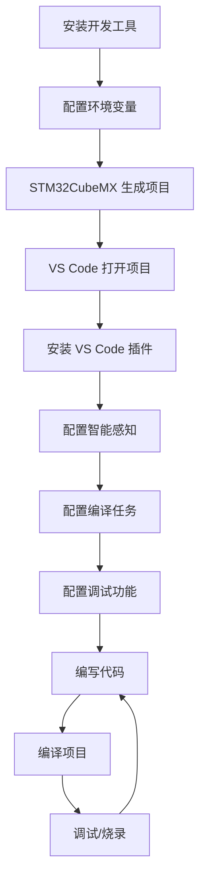

### 🔄 开发循环

```
┌─────────────────────────────────────────────────────────┐
│  1. STM32CubeMX 生成项目                                 │
│     ↓                                                    │
│  2. VS Code 打开项目                                     │
│     ↓                                                    │
│  3. 编写逻辑代码 (main.c, gpio.c 等)                    │
│     ↓                                                    │
│  4. make 编译 (arm-none-eabi-gcc)                        │
│     ↓                                                    │
│  5. OpenOCD 烧录/调试 (.bin/.hex)                       │
│     ↓                                                    │
│  6. F5 启动调试 (Cortex-Debug)                           │
│     ↓                                                    │
│  7. 查看变量、寄存器、外设状态                            │
│     ↓                                                    │
│  8. 修改代码，回到步骤 3                                 │
└─────────────────────────────────────────────────────────┘
```

### 📝 详细步骤说明

#### 阶段一：项目初始化

1. **使用 STM32CubeMX 创建项目**
   - 选择芯片型号
   - 配置外设（GPIO、时钟、调试接口等）
   - 生成 Makefile 项目

2. **打开项目**
   - 用 VS Code 打开项目文件夹
   - 检查项目结构是否正确

#### 阶段二：开发环境配置

3. **安装 VS Code 插件**
   - C/C++
   - Cortex-Debug
   - 其他推荐插件

4. **配置智能感知**
   - 创建 `c_cpp_properties.json`
   - 配置头文件路径和宏定义

5. **配置编译任务**
   - 创建 `tasks.json`
   - 配置 build 和 clean 任务

#### 阶段三：调试配置

6. **配置 OpenOCD**
   - 创建 `openocd.cfg` 文件
   - 配置调试器接口和目标芯片

7. **配置调试功能**
   - 下载 SVD 文件
   - 创建 `launch.json`
   - 配置调试参数

#### 阶段四：开发与调试

8. **编写代码**
   - 在 `Src/` 目录下编写应用代码
   - 在 `Inc/` 目录下编写头文件

9. **编译项目**
   - 使用 `Ctrl+Shift+P` → `Tasks: Run Task` → `build`
   - 或直接在终端运行 `make`

10. **调试项目**
    - 按 `F5` 启动调试
    - 设置断点
    - 查看变量、寄存器、外设状态

---

## 详细配置步骤

## 1. 使用 STM32CubeMX 创建工程

STM32CubeMX 生成的是使用 HAL 库开发的项目。本节介绍重要配置部分。

### 1.1. 安装支持包

在主页右边可以安装不同芯片的支持包，例如 F1 系列、F4 系列等。

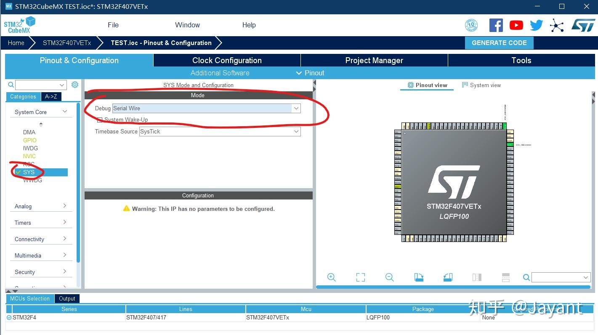

### 1.2. Debug 接口配置

1. 左上角 `File` → `New Project` 新建项目
2. 新建项目后，在 `SYS` 里选择 Debug 接口
   - 选择 `SWD`（推荐）或 `JTAG`
   - 注意：这里的框默认可能是叠起来的，需要自己拉出来


### 1.3. 时钟配置

1. **配置外部时钟源**
   - 在 `RCC` 里选择高速外部时钟（HSE）和低速外部时钟源（LSE）
   - 根据板子上的晶振选择，通常选择晶振（Crystal/Ceramic Resonator）

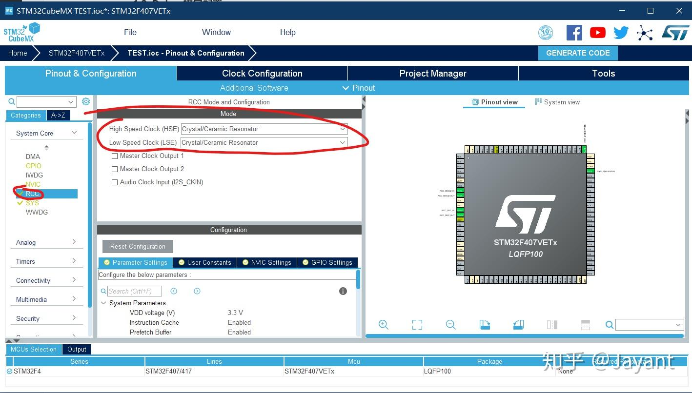

2. **配置系统时钟**
   - 选择 "Clock Configuration" 标签
   - 在左边填好外部晶振的频率
   - 在右边填上自己想要的主频，CubeMX 会自动帮你配置锁相环
   - 可以直接写最大值（例如 STM32F103 为 72MHz）

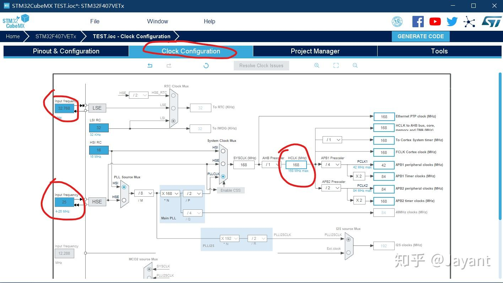

### 1.4. 项目配置

在 `Project Manager` 标签页：

- **Toolchain/IDE**：选择 `Makefile`
- **Project Structure**：可以选择 `Basic` 或 `Advanced`
  - `Basic`：简单的目录结构
  - `Advanced`：更详细的目录结构（如果选择 Advanced，后续 VS Code 配置需要相应调整）

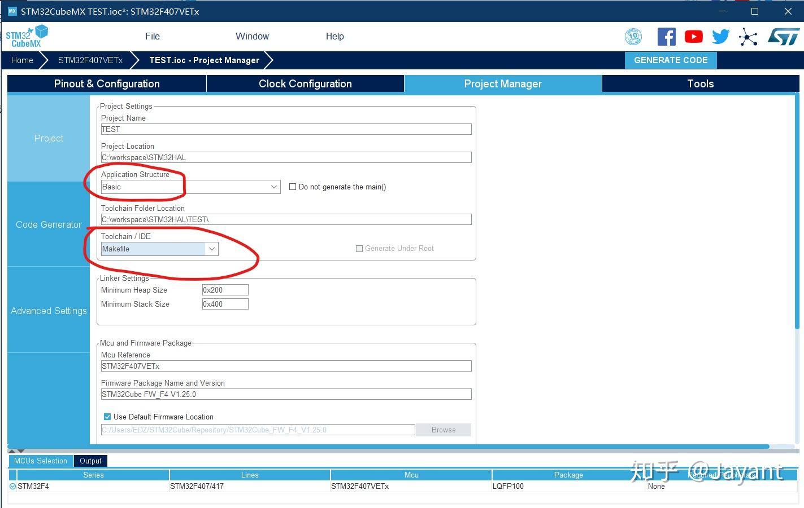

### 1.5. 代码生成器配置

推荐勾选以下选项：

- ✅ Generate peripheral initialization as a pair of '.c/.h' files per peripheral
- ✅ Backup previously generated files when re-generating
- ✅ Keep User Code when re-generating
- ✅ Delete previously generated files when not re-generated

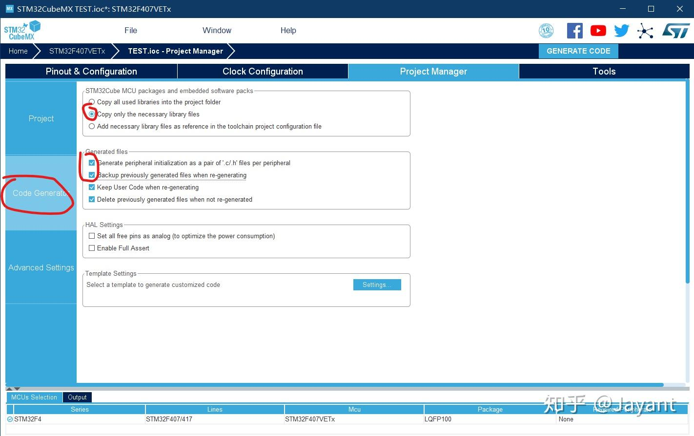

### 1.6. 生成代码

点击右上角的 **GENERATE CODE** 生成代码。

---

## 2. 配置 VS Code

用 VS Code 打开工程文件夹，你将看到这样的目录结构：

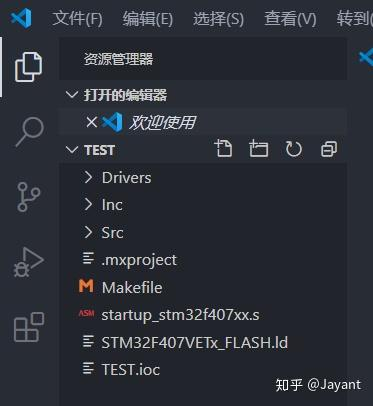

**重要说明**：
- `.ioc` 和 `.mxproject` 文件是 STM32CubeMX 的工程文件
- `Drivers/` 里是 STM32 和 ARM CMSIS 的库，**最好不要修改**
- `Inc/` 和 `Src/` 是供用户修改的源码目录

### 2.1. 安装 VS Code 插件

在插件商店搜索并安装以下插件：

| 插件名称 | 功能说明 |
|---------|---------|
| **Chinese (Simplified)** | VS Code 中文语言支持 |
| **C/C++** | 提供代码补全、智能感知和 Debug 功能 |
| **C/C++ Snippets** | 代码模板工具（例如输入 `for` 自动补全 for 循环） |
| **Cortex-Debug** | 核心插件，用于 ARM 工具链和 OpenOCD 的图形化调试 |

> **注意**：
> - VS Code 可能会推荐安装 `C/C++ Intellisense` 插件，但它依赖于 GNU Global 工具，ARM 工具链里没有这个，所以**不用装**
> - ARM 汇编语言高亮插件（2025 注：好像找不到了，不装不影响使用）

### 2.2. 配置 VS Code 内置终端

> **2025 注**：不配置没有影响，新建终端后点终端框框上面的加号加一个 Git Bash 就可以了。

### 2.3. 配置智能感知

此时敲 `make` 已经可以编译成功了，但是 VS Code 的编辑窗口里会显示很多红色波浪线。这是因为 VS Code 的智能感知需要额外配置。

#### 问题原因

还记得使用 Keil 开发时，Project Options 里的全局宏定义吗？

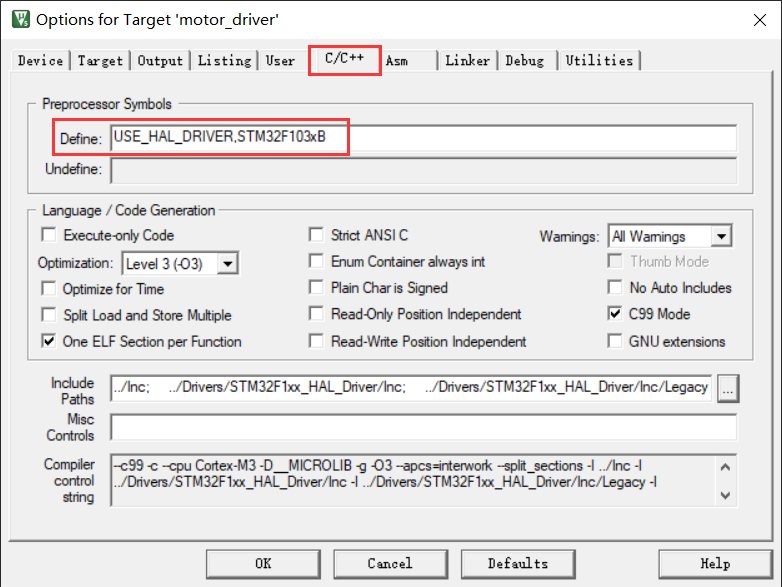

在通过 Makefile 组织的项目中，这些宏是通过 gcc 的 `-D` 参数在编译时添加的：

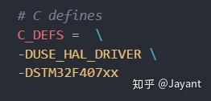

但是，VS Code 只是一个编辑器，它检查代码的时候并不会去读 Makefile，而是只看 `.h` 和 `.c` 文件。于是 `STM32F1xx.h` 中就检测不到那个宏，表现为灰色（认为这个宏没有被定义）：

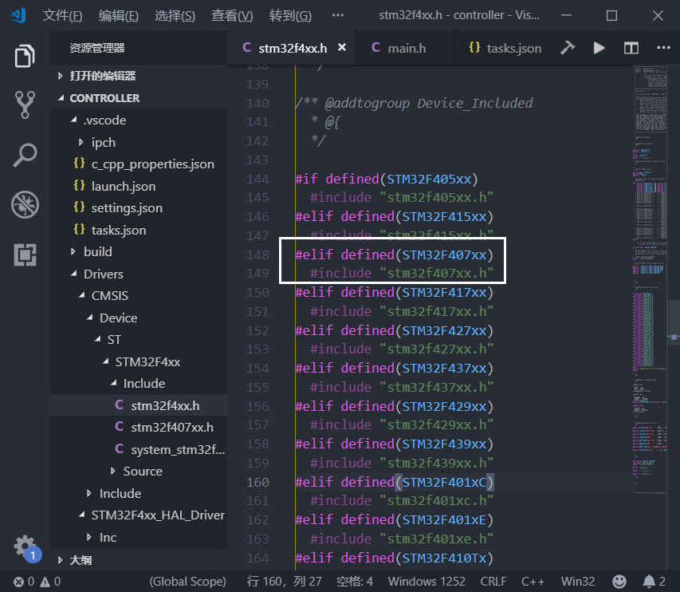

因此会出现一大串 "xxxx is undefined" 之类的报错，但直接去 `make` 的话是没有问题的。

#### 解决方案

我们需要在当前目录的 `.vscode` 文件夹下创建 `c_cpp_properties.json` 配置文件，用来告诉 VS Code 我们定义了这些宏。

**方法一：自动生成**

1. 随便找到一处红色波浪线，点击并把光标移到那一行
2. 左上角会出现一个黄色小灯泡
3. 点击黄色小灯泡并选择 "编辑 'includePath 设置'"

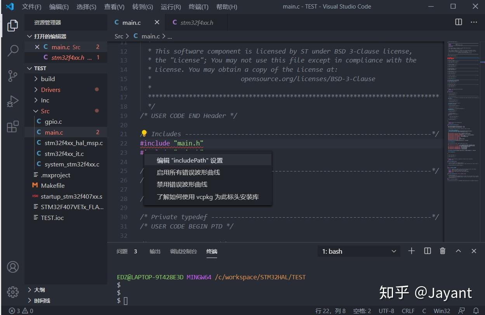

4. 选择 "使用 c_cpp_properties.json 来配置"

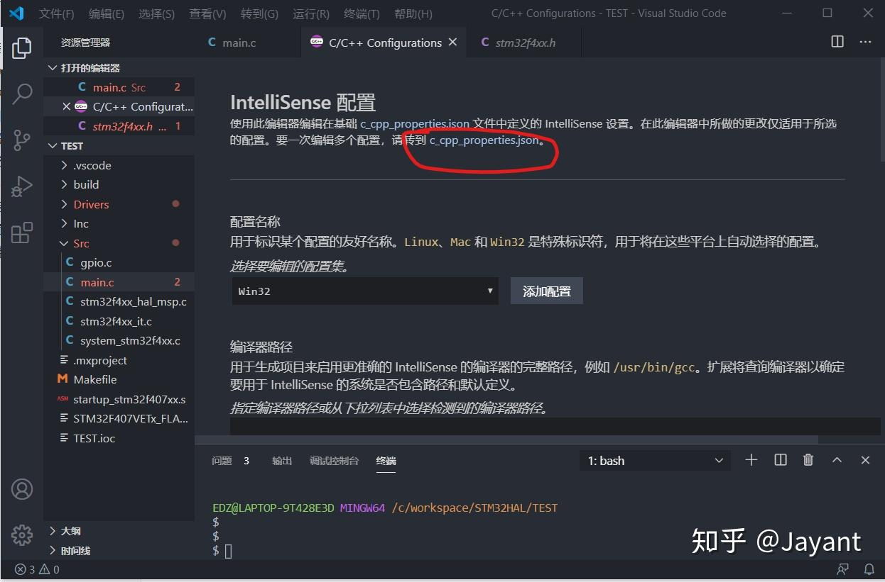

**方法二：手动创建**

在 `.vscode` 目录下创建 `c_cpp_properties.json` 文件，内容如下：

```json
{
    "configurations": [
        {
            "name": "Win32",
            "includePath": [
                "C:/Program Files (x86)/GNU Arm Embedded Toolchain/9 2020-q2-update/lib/gcc/arm-none-eabi/9.3.1/include",
                "${workspaceFolder}/Inc",
                "${workspaceFolder}/Drivers/STM32F1xx_HAL_Driver/Inc",
                "${workspaceFolder}/Drivers/STM32F1xx_HAL_Driver/Inc/Legacy",
                "${workspaceFolder}/Drivers/CMSIS/Device/ST/STM32F1xx/Include",
                "${workspaceFolder}/Drivers/CMSIS/Include"
            ],
            "defines": [
                "USE_HAL_DRIVER",
                "STM32F103xx"
            ],
            "compilerPath": "C:/Program Files (x86)/GNU Arm Embedded Toolchain/9 2020-q2-update/bin/arm-none-eabi-gcc.exe",
            "intelliSenseMode": "gcc-x64",
            "browse": {
                "limitSymbolsToIncludedHeaders": true,
                "databaseFilename": "",
                "path": [
                    "${workspaceFolder}"
                ]
            }
        }
    ],
    "version": 4
}
```

#### 配置说明

| 配置项 | 说明 |
|--------|------|
| **`name`** | 平台标签，可以是 `Win32`、`Linux` 或 `Mac`。可以写多组配置，VS Code 会根据操作系统自动适配 |
| **`includePath`** | 告诉 VS Code 该去哪里查找头文件。第一个目录是 C 语言标准库的目录，剩下的几个目录可以从 Makefile 里复制然后稍微修改 |
| **`defines`** | 全局宏定义，告诉 VS Code 这些宏都被定义了。上述两个宏是 Makefile 里的 |
| **`compilerPath`** | 指定编译器的路径。指定后，所有编译器自带的宏（如 `__GNUC__`）都会自动导入 VS Code |
| **`intelliSenseMode`** | 因为我们用的是 gcc，所以选 `gcc-x64` |
| **`browse.path`** | 源文件搜索路径，用于代码补全和查找定义。这个路径和 `includePath` 不同，`browse.path` 是自动递归所有子目录的 |

**路径变量说明**：
- `${workspaceFolder}`：表示项目文件夹的绝对路径

保存 `c_cpp_properties.json` 文件后，发现左边目录里一个红点都没有了！

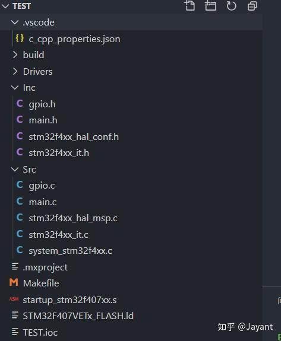

### 2.4. 让 Git 集成 Make

> **注意**：如果 Git Bash 中已经可以使用 `make` 命令，可以跳过此步骤。

1. 访问 https://sourceforge.net/projects/ezwinports/files/
2. 下载 `make-4.1-2-without-guile-w32-bin.zip`
3. 解压文件
4. 把解压出来的文件全部拷贝到 Git 的安装目录下：`C:\Program Files\Git\mingw64\`
5. 合并文件夹，如果跳出来需要替换的文件要选择**不替换**

这样在 Git Bash 窗口下就可以执行 `make` 了。

### 2.5. 配置 Build 任务

直接在终端里敲一个 `make`，就会根据 Makefile 的内容，在当前目录下创建一个 `build` 文件夹，在里面生成：
- 每个源文件生成的 `.o` 文件
- 最终链接得到的 `.elf` 文件（用于调试）
- 用于直接下载用的十六进制文件 `.hex` 和二进制文件 `.bin`

编译成功的话看起来就像这样：

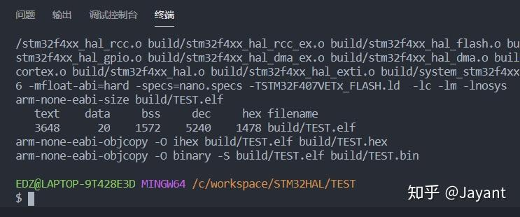

为了方便后续操作，我们在 `.vscode` 目录下创建 `tasks.json` 文件（**文件名里别少了 s！**），内容如下：

```json
{
    // See https://go.microsoft.com/fwlink/?LinkId=733558
    // for the documentation about the tasks.json format
    "version": "2.0.0",
    "tasks": [
        {
            "label": "build",
            "type": "shell",
            "command": "make",
            "args": [
                "-j4"
            ],
            "problemMatcher": [
                "$gcc"
            ],
            "group": {
                "kind": "build",
                "isDefault": true
            }
        },
        {
            "label": "clean",
            "type": "shell",
            "command": "make",
            "args": [
                "clean"
            ],
            "problemMatcher": []
        }
    ]
}
```

**配置说明**：
- `build` 任务：执行 `make -j4`（使用 4 个并行任务加速编译）
- `clean` 任务：执行 `make clean`（清理编译产物）
- `"isDefault": true`：设置为默认构建任务，可以使用 `Ctrl+Shift+B` 快速构建

**执行任务的方法**：
1. 使用快捷键：`Ctrl+Shift+B`（执行默认构建任务）
2. 使用命令面板：按 `Ctrl+P`，然后输入 `task[空格]`，就会出现可用的任务列表
3. 在终端中直接运行：`make` 或 `make clean`

至此，编译的部分已经完成。

---

## 3. 配置调试功能

### 3.1. OpenOCD 配置

直接在项目文件夹下新建一个 `openocd.cfg` 文件，内容如下：

```tcl
# 选择调试器为 ST-Link
source [find interface/stlink.cfg]
# 如果使用 J-Link，取消下面这行的注释
#source [find interface/jlink.cfg]
# 如果使用 CMSIS-DAP，取消下面这行的注释
#source [find interface/cmsis-dap.cfg]

# 选择接口为 SWD
transport select swd

# 选择目标芯片
source [find target/stm32f1x.cfg]

# 复位配置
reset_config none
```

**配置说明**：
- OpenOCD 启动时，会自动在当前目录下寻找名为 `openocd.cfg` 的文件作为配置文件
- 配置文件中引用到的其他配置文件，都在 OpenOCD 安装目录下的 `share/openocd/scripts` 目录下
  - `interface/` 目录下都是接口相关配置文件
  - `target/` 目录下都是芯片相关的配置文件

### 3.2. 下载 SVD 文件

SVD（System View Description）文件用于描述微控制器的外设寄存器地址和结构。

1. 访问 [CMSIS-SVD STM32](https://github.com/modm-io/cmsis-svd-stm32)
2. 找到对应芯片系列的 SVD 文件（例如 `STM32F1.svd`）
3. 下载后放在项目文件夹根目录即可

**SVD 文件的作用**：
- VS Code 可以通过它来知道外设寄存器的地址分布
- 从而把寄存器内容展示到调试窗口中
- 每个单片机都不同，需要下载对应的 SVD 文件

### 3.3. 配置 VS Code 的调试功能

在 `.vscode` 文件夹中新建一个 `launch.json`，内容如下：

```json
{
    // 使用 IntelliSense 了解相关属性
    // 悬停以查看现有属性的描述
    // 欲了解更多信息，请访问: https://go.microsoft.com/fwlink/?linkid=830387
    "version": "0.2.0",
    "configurations": [
        {
            "name": "Cortex Debug",
            "cwd": "${workspaceRoot}",
            "executable": "${workspaceRoot}/build/${workspaceFolderBasename}.elf",
            "request": "launch",
            "type": "cortex-debug",
            "device": "STM32F103VE",
            "svdFile": "./STM32F103.svd",
            "servertype": "openocd",
            "configFiles": [
                "${workspaceRoot}/openocd.cfg"
            ],
            "preLaunchTask": "build",
            "armToolchainPath": "C:/Program Files (x86)/GNU Arm Embedded Toolchain/9 2020-q2-update/bin",
            "runToMain": true
        }
    ]
}
```

**配置项说明**：

| 配置项 | 说明 |
|--------|------|
| **`executable`** | 编译出的二进制文件，也就是最终烧录到单片机中的 ELF 文件。根据芯片的不同，可能产生不同的名称和后缀 |
| **`request`** | 可以选 `launch` 或 `attach`。`launch` 是指启动调试时同时开始执行程序；`attach` 是指程序已经在运行了，然后开始调试 |
| **`type`** | 调试的类型，选 `cortex-debug`，这是我们装的插件 |
| **`device`** | 目标芯片。如果使用 J-LINK GDB Server 时必须要设置这个选项。使用 OpenOCD 时可选（有可能帮助自动选择 SVD 文件） |
| **`svdFile`** | SVD 文件的路径 |
| **`servertype`** | 要选择的 GDB Server。我们用 `openocd` |
| **`configFiles`** | GDB Server 的配置文件路径。其实 OpenOCD 会自动读当前目录下的 `openocd.cfg` 文件，这个选项不填也行 |
| **`preLaunchTask`** | 在启动调试前，预先执行的任务。在这里我们设置为前面配置的 `build` 任务。这样每次调试前都会先自动编译 |
| **`armToolchainPath`** | 工具链的路径。配置了全局环境变量的情况下好像不设置也行 |
| **`runToMain`** | 启动调试后自动运行到 `main` 函数 |

### 3.4. 测试使用

保存以上所有文件后，目录结构应该是这样：

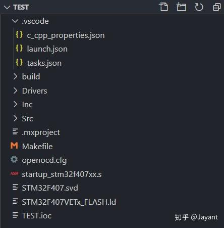

**开始调试**：
1. 连接 ST-Link 到开发板
2. 按 `F5` 启动调试
3. 可以看到以下调试窗口：
   - **变量窗口**：查看局部变量和全局变量
   - **调用堆栈**：查看函数调用关系
   - **断点**：管理断点
   - **外设寄存器**：查看外设寄存器值（需要 SVD 文件）
   - **CPU 寄存器**：查看 CPU 寄存器值

---

## 项目结构说明

### 📁 完整目录结构

```
Z:.
│
├─ .mxproject              # STM32CubeMX 项目的配置文件
│  Makefile                # 编译配置文件
│  openocd.cfg             # OpenOCD 调试配置文件（定义了调试器接口、目标芯片类型等信息）
│  readme.md               # 本文档
│  startup_stm32f103xb.s   # STM32 启动文件（负责 STM32 微控制器的启动过程）
│  STM32F103.svd           # SVD 文件（描述了目标芯片的外设寄存器地址和结构）
│  STM32F103XX_FLASH.ld    # 链接脚本文件（定义程序如何在 STM32 存储器中布局）
│  TEST1.ioc               # STM32CubeMX 工程文件（包含了硬件配置和外设设置）
│
├─ .vscode                 # VS Code 配置文件目录
│  ├─ c_cpp_properties.json      # C/C++ 智能感知配置
│  ├─ launch.json                # 调试配置文件
│  ├─ tasks.json                  # 任务配置文件（编译、清理等）
│  └─ settings.json               # VS Code 工作区设置
│
├─ build                   # 编译输出目录
│  ├─ *.o                   # 目标文件
│  ├─ *.d                   # 依赖文件
│  ├─ *.lst                 # 列表文件
│  ├─ TEST1.elf             # ELF 可执行文件（用于调试）
│  ├─ TEST1.hex             # Intel HEX 格式文件（用于烧录）
│  ├─ TEST1.bin             # 二进制文件（用于烧录）
│  └─ TEST1.map             # 内存映射文件
│
├─ Drivers                  # STM32 HAL 库和 CMSIS 库（不要修改）
│  ├─ CMSIS                 # ARM CMSIS 核心文件
│  │  ├─ Device
│  │  │  └─ ST
│  │  │     └─ STM32F1xx
│  │  │        ├─ Include   # 芯片相关头文件
│  │  │        └─ Source    # 芯片相关源文件
│  │  └─ Include            # CMSIS 核心头文件
│  └─ STM32F1xx_HAL_Driver  # STM32 HAL 驱动库
│     ├─ Inc                # HAL 库头文件
│     └─ Src                # HAL 库源文件
│
├─ img                      # 文档图片资源
│
├─ Inc                      # 用户头文件目录
│  ├─ gpio.h                # GPIO 配置头文件
│  ├─ main.h                # 主程序头文件
│  ├─ stm32f1xx_hal_conf.h  # HAL 库配置文件
│  └─ stm32f1xx_it.h        # 中断处理函数声明
│
└─ Src                      # 用户源文件目录
   ├─ gpio.c                # GPIO 配置源文件
   ├─ main.c                # 主程序源文件
   ├─ stm32f1xx_hal_msp.c   # HAL 库 MSP 初始化文件
   ├─ stm32f1xx_it.c        # 中断处理函数实现
   ├─ syscalls.c            # 系统调用实现（用于 printf 等）
   ├─ sysmem.c              # 内存管理实现
   └─ system_stm32f1xx.c    # 系统初始化文件
```

### 📄 重要文件说明

| 文件 | 说明 |
|------|------|
| **`Makefile`** | 定义编译规则、源文件列表、编译选项等 |
| **`openocd.cfg`** | OpenOCD 调试配置文件，定义调试器类型、接口类型、目标芯片等 |
| **`startup_stm32f103xb.s`** | 启动文件，包含复位处理、中断向量表、堆栈初始化等 |
| **`STM32F103XX_FLASH.ld`** | 链接脚本，定义程序在 Flash 和 RAM 中的布局 |
| **`STM32F103.svd`** | SVD 文件，描述外设寄存器结构，用于调试时显示寄存器值 |
| **`TEST1.ioc`** | STM32CubeMX 工程文件，包含硬件配置信息 |

---

## 开发文档

### 🎯 项目概述

本项目是一个基于 STM32F103 的嵌入式开发项目，使用 VS Code 作为开发环境，STM32CubeMX 进行硬件配置，HAL 库进行开发。

### 📚 HAL 库使用指南

#### GPIO 操作

**初始化 GPIO**（通常在 `gpio.c` 中）：

```c
void MX_GPIO_Init(void)
{
    GPIO_InitTypeDef GPIO_InitStruct = {0};
    
    // 使能 GPIO 时钟
    __HAL_RCC_GPIOA_CLK_ENABLE();
    
    // 配置 GPIO
    GPIO_InitStruct.Pin = GPIO_PIN_5;
    GPIO_InitStruct.Mode = GPIO_MODE_OUTPUT_PP;
    GPIO_InitStruct.Pull = GPIO_NOPULL;
    GPIO_InitStruct.Speed = GPIO_SPEED_FREQ_LOW;
    HAL_GPIO_Init(GPIOA, &GPIO_InitStruct);
}
```

**GPIO 操作示例**：

```c
// 设置 GPIO 为高电平
HAL_GPIO_WritePin(GPIOA, GPIO_PIN_5, GPIO_PIN_SET);

// 设置 GPIO 为低电平
HAL_GPIO_WritePin(GPIOA, GPIO_PIN_5, GPIO_PIN_RESET);

// 读取 GPIO 状态
GPIO_PinState state = HAL_GPIO_ReadPin(GPIOA, GPIO_PIN_5);

// 翻转 GPIO 状态
HAL_GPIO_TogglePin(GPIOA, GPIO_PIN_5);
```

#### 延时函数

```c
// HAL 库延时函数（单位：毫秒）
HAL_Delay(1000);  // 延时 1 秒

// 注意：HAL_Delay 依赖于 SysTick，需要正确配置系统时钟
```

#### 中断处理

**配置外部中断**：

```c
// 在 gpio.c 中配置
GPIO_InitStruct.Pin = GPIO_PIN_0;
GPIO_InitStruct.Mode = GPIO_MODE_IT_RISING;  // 上升沿触发
GPIO_InitStruct.Pull = GPIO_PULLDOWN;
HAL_GPIO_Init(GPIOA, &GPIO_InitStruct);

// 使能中断
HAL_NVIC_SetPriority(EXTI0_IRQn, 0, 0);
HAL_NVIC_EnableIRQ(EXTI0_IRQn);
```

**中断处理函数**（在 `stm32f1xx_it.c` 中）：

```c
void EXTI0_IRQHandler(void)
{
    HAL_GPIO_EXTI_IRQHandler(GPIO_PIN_0);
}

// 回调函数（在 main.c 或 gpio.c 中实现）
void HAL_GPIO_EXTI_Callback(uint16_t GPIO_Pin)
{
    if (GPIO_Pin == GPIO_PIN_0)
    {
        // 处理中断
    }
}
```

### 🔧 编译系统

#### Makefile 关键变量

| 变量 | 说明 |
|------|------|
| `TARGET` | 目标文件名（例如：TEST1） |
| `C_SOURCES` | C 源文件列表 |
| `ASM_SOURCES` | 汇编源文件列表 |
| `C_DEFS` | C 编译宏定义 |
| `C_INCLUDES` | 头文件搜索路径 |
| `CFLAGS` | C 编译选项 |
| `LDFLAGS` | 链接选项 |

#### 编译选项说明

- `-Og`：优化级别，适合调试
- `-g -gdwarf-2`：生成调试信息
- `-Wall`：显示所有警告
- `-fdata-sections -ffunction-sections`：将每个函数和数据放入独立的段
- `-Wl,--gc-sections`：链接时删除未使用的段（减小代码体积）

### 🐛 调试技巧

#### 断点使用

1. **设置断点**：在代码行号左侧点击，或按 `F9`
2. **条件断点**：右键断点，设置条件表达式
3. **日志断点**：右键断点，设置日志消息（不停止执行）

#### 查看变量

- **局部变量**：在 "变量" 窗口中自动显示
- **监视表达式**：在 "监视" 窗口中添加表达式
- **调用堆栈**：查看函数调用关系

#### 查看寄存器

- **CPU 寄存器**：在 "寄存器" 窗口中查看
- **外设寄存器**：在 "外设" 窗口中查看（需要 SVD 文件）

#### 常用调试快捷键

| 快捷键 | 功能 |
|--------|------|
| `F5` | 启动/继续调试 |
| `F9` | 设置/取消断点 |
| `F10` | 单步跳过（Step Over） |
| `F11` | 单步进入（Step Into） |
| `Shift+F11` | 单步跳出（Step Out） |
| `Shift+F5` | 停止调试 |

### 📝 代码规范建议

1. **用户代码区域**：在 `/* USER CODE BEGIN */` 和 `/* USER CODE END */` 之间编写代码，避免被 CubeMX 覆盖
2. **函数命名**：使用有意义的函数名，遵循 HAL 库命名规范
3. **注释**：关键代码添加注释说明
4. **错误处理**：检查 HAL 库函数返回值

### 🔄 重新生成代码

当使用 STM32CubeMX 修改配置后：

1. 点击 **GENERATE CODE**
2. 如果提示覆盖文件，选择保留用户代码
3. 检查生成的代码是否有冲突
4. 重新编译项目

---

## 常见问题

### ❓ 编译问题

**Q: 编译时提示找不到头文件**

A: 检查 `c_cpp_properties.json` 中的 `includePath` 配置是否正确，路径中的反斜杠需要转义或使用正斜杠。

**Q: 编译时提示未定义的宏**

A: 检查 `c_cpp_properties.json` 中的 `defines` 配置，确保包含 `USE_HAL_DRIVER` 和芯片型号宏（如 `STM32F103xx`）。

**Q: 编译时提示找不到工具链**

A: 检查环境变量 `PATH` 中是否包含工具链的 `bin` 目录，并重启电脑。

### ❓ 调试问题

**Q: 按 F5 后提示找不到 OpenOCD**

A: 
1. 检查环境变量 `PATH` 中是否包含 OpenOCD 的 `bin` 目录
2. 检查 `launch.json` 中的 `armToolchainPath` 是否正确
3. 尝试在终端中直接运行 `openocd -f openocd.cfg` 测试

**Q: 调试时提示无法连接到目标**

A:
1. 检查 ST-Link 是否正确连接到开发板
2. 检查 `openocd.cfg` 中的接口配置是否正确
3. 检查驱动是否正确安装（Windows 可能需要使用 Zadig 安装驱动）

**Q: 调试时看不到外设寄存器**

A: 检查 `launch.json` 中的 `svdFile` 路径是否正确，确保 SVD 文件存在于项目根目录。

**Q: 调试时程序无法运行到 main 函数**

A: 检查 `launch.json` 中的 `executable` 路径是否正确，确保 ELF 文件已成功编译。

### ❓ VS Code 问题

**Q: VS Code 中显示大量红色波浪线，但编译正常**

A: 这是智能感知的问题，检查 `c_cpp_properties.json` 配置是否正确。

**Q: 代码补全不工作**

A: 
1. 检查 `c_cpp_properties.json` 中的 `compilerPath` 是否正确
2. 重新加载 VS Code 窗口（`Ctrl+Shift+P` → `Reload Window`）

**Q: 终端中无法使用 make 命令**

A: 参考 [2.4. 让 Git 集成 Make](#24-让-git-集成-make) 章节，或直接在 Git Bash 中使用。

### ❓ 其他问题

**Q: 如何切换不同的 STM32 芯片**

A:
1. 在 STM32CubeMX 中重新选择芯片并生成代码
2. 更新 `c_cpp_properties.json` 中的 `defines`（芯片型号宏）
3. 更新 `openocd.cfg` 中的目标芯片配置
4. 下载对应的 SVD 文件并更新 `launch.json` 中的 `svdFile`

**Q: 如何添加新的源文件**

A:
1. 在 `Src/` 目录下创建新的 `.c` 文件
2. 在 `Inc/` 目录下创建对应的 `.h` 文件
3. 在 `Makefile` 的 `C_SOURCES` 中添加新文件路径
4. 重新编译

---

## 快速参考

### 🚀 常用命令

```bash
# 编译项目
make

# 多线程编译（加速）
make -j4

# 清理编译产物
make clean

# 查看编译后的文件大小
arm-none-eabi-size build/TEST1.elf

# 启动 OpenOCD（手动）
openocd -f openocd.cfg

# 查看工具链版本
arm-none-eabi-gcc --version
arm-none-eabi-gdb --version
openocd --version
```

### 📋 快捷键速查

| 操作 | 快捷键 |
|------|--------|
| 构建项目 | `Ctrl+Shift+B` |
| 启动调试 | `F5` |
| 设置断点 | `F9` |
| 单步跳过 | `F10` |
| 单步进入 | `F11` |
| 单步跳出 | `Shift+F11` |
| 停止调试 | `Shift+F5` |
| 运行任务 | `Ctrl+Shift+P` → `task` |

### 🔗 有用链接

- [STM32CubeMX 下载](https://www.st.com.cn/zh/development-tools/stm32cubemx.html)
- [ARM 工具链下载](https://developer.arm.com/downloads/-/arm-gnu-toolchain-downloads)
- [OpenOCD 文档](http://openocd.org/doc/html/index.html)
- [CMSIS-SVD STM32](https://github.com/modm-io/cmsis-svd-stm32)
- [STM32 HAL 库文档](https://www.st.com/resource/en/user_manual/um1725-description-of-stm32f1-hal-and-lowlayer-drivers-stmicroelectronics.pdf)

---

## 📝 更新日志

- **2025-01-XX**: 初始版本，基于 @Jayant 的教程整理和补充

---

## 📄 许可证

本项目遵循 STM32 HAL 库的许可证要求。详见 `Drivers/` 目录下的 LICENSE 文件。

---

**Happy Coding! 🎉**
