【经验分享】HAL库 STM32CubeMX教程六----定时器中断
[复制链接]
 STMCU小助手发布时间：2022-3-25 12:38
前言：
今天我们来学习定时器，32的定时器有着非常丰富的功能， 输入捕获/输出比较，PWM,中断等等。是我们学习STM32最频繁使用到的外设之一，所以一定要掌握好，这节我们讲解定时器中断，本系列教程将对应外设原理，HAL库与STM32CubeMX结合在一起讲解，使您可以更快速的学会各个模块的使用


所用工具：

1、芯片： STM32F407ZET6/STM32F103ZET6

2、STM32CubeMx软件

3、IDE： MDK-Keil软件

4、STM32F1xx/STM32F4xxHAL库


知识概括：

通过本篇博客您将学到：

SMT32定时器原理

STM32CubeMX创建定时器例程

HAL库TIM定时器函数库

定时器中断的创建与使用

定时器简介：
SMT32F1系列共有8个定时器：

高级定时器（TIM1、TIM8）；通用定时器（TIM2、TIM3、TIM4、TIM5）；基本定时器（TIM6、TIM7）。

SMT32F4系列共有15个定时器：

高级定时器（TIM1、TIM8）；通用定时器（TIM2、TIM3、TIM4、TIM5、TIM9~TIM14）；基本定时器（TIM6、TIM7）。


基本定时器功能（TIM6、TIM7）：
16位向上、向下、向上/下自动装载计数器
16位可编程(可以实时修改)预分频器，计数器时钟频率的分频系数为1～65535之间的任意数值
触发DAC的同步电路 注:此项是TIM6/7独有功能.
位于APB1总线上

通用定时器(TIM2~TIM5)的主要功能:
1.16位向上、向下、向上/下自动装载计数器
2.16位可编程(可以实时修改)预分频器，计数器时钟频率的分频系数为1～65535之间的任意数值
3.4 个独立通道（TIMx_CH1~4）可以用作：
                  测量输入信号的脉冲长度( 输入捕获)
                  输出比较
                  单脉冲模式输出
                  PWM输出(边缘或中间对齐模式)
4.支持针对定位的增量(正交)编码器和霍尔传感器电路
5.如下事件发生时产生中断/DMA：
               更新：计数器向上溢出/向下溢出，计数器初始化(通过软件或者内部/外部触发)
              触发事件(计数器启动、停止、初始化或者由内部/外部触发计数)
              输入捕获  
              输出比较  
6.位于APB1总线上

高级定时器（TIM1，TIM8）的主要功能：
高级定时器具有基本，通用定时器的所有的功能，
还具有控制交直流电动机所有的功能，
输出6路互补带死区的信号，刹车功能等等
位于APB2总线上
总括：基本定时器就是单纯的定时计数器，通用定时器多了四个通道，相对应的增加了功能，高级定时器具有基本，通用定时器的所有的功能，并且添加了其他功能
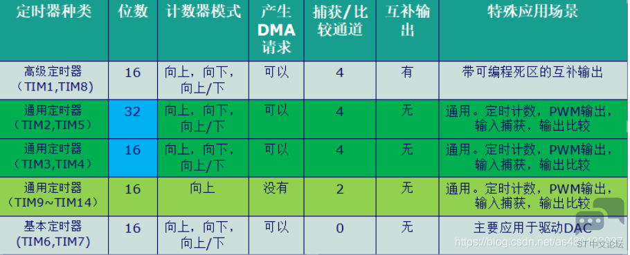

定时器计数模式
通用定时器可以向上计数、向下计数、向上向下双向计数模式。

向上计数模式：计数器从0计数到自动加载值（TIMx_ARR），然后重新从0开始计数并且产生一个计数器溢出事件。
向下计数模式：计数器从自动装入的值（TIMx_ARR）开始向下计数到0，然后从自动装入的值重新开始，并产生一个计数器向下溢出事件。
中央对齐模式（向上/向下计数）：计数器从0开始计数到自动装入的值-1，产生一个计数器溢出事件，然后向下计数到1并且产生一个计数器溢出事件；然后再从0开始重新计数。

简单地理解三种计数模式，可以通过下面的图形：
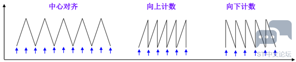
计数时钟的选择
计数器时钟可由下列时钟源提供：
内部时钟（TIMx_CLK）
外部时钟模式1：外部捕捉比较引脚（TIx）
外部时钟模式2：外部引脚输入（TIMx_ETR） 仅适用TIM2,3,4
内部触发输入（ITRx）：使用一个定时器作为另一个定时器的预分频器，如可以配置一个定时器Timer1而作为另一个定时器Timer2的预分频器。

定时器的主从模式：   (选看)
定时器一般是通过软件设置而启动，STM32的每个定时器也可以通过外部信号触发而启动，还可以通过另外一个定时器的某一个条件被触发而启动。这里所谓某一个条件可以是定时到时间、定时器超时、比较成功等许多条件。

这种通过一个定时器触发另一个定时器的工作方式称为定时器的同步，发出触发信号的定时器工作于主模式，接受触发信号而启动的定时器工作于从模式

触发条件：
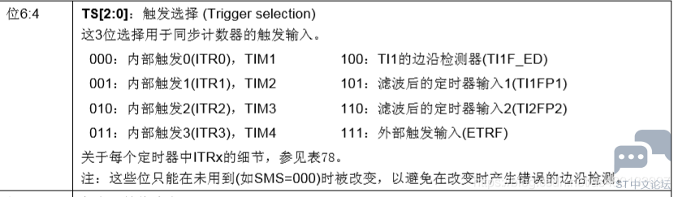

定时器的四种主从机模式：
外部触发模式1
IRC重置模式
门控模式
触发模式

工程创建
1设置RCC
设置高速外部时钟HSE 选择外部时钟源

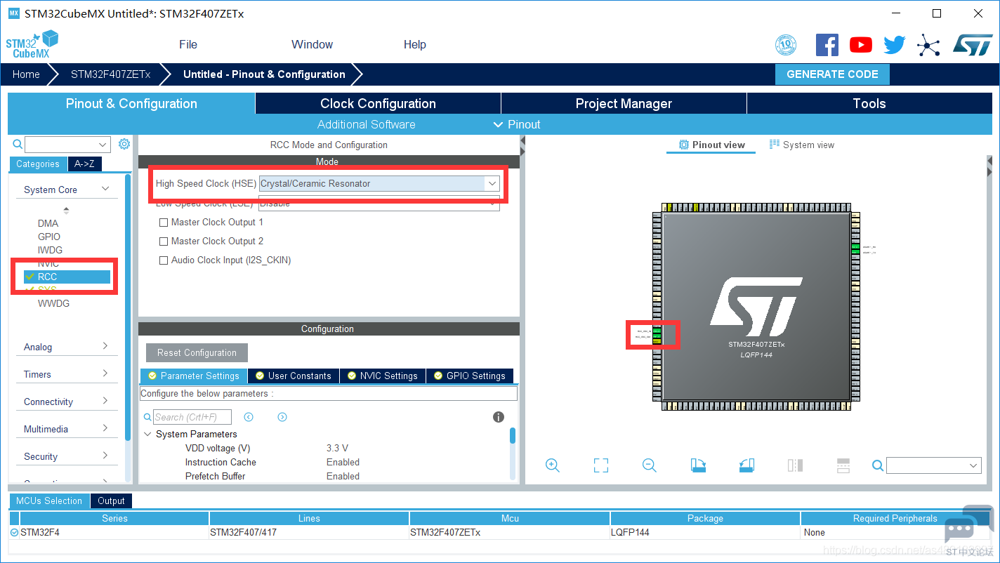
2设置时钟
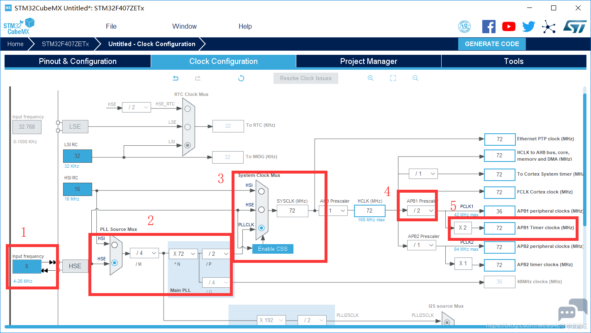
我的是  外部晶振为8MHz
1.选择外部时钟HSE 8MHz   
2.PLL锁相环倍频72倍
3.系统时钟来源选择为PLL
4.设置APB1分频器为 /2
5.这时候定时器的时钟频率为72Mhz

3定时器设置
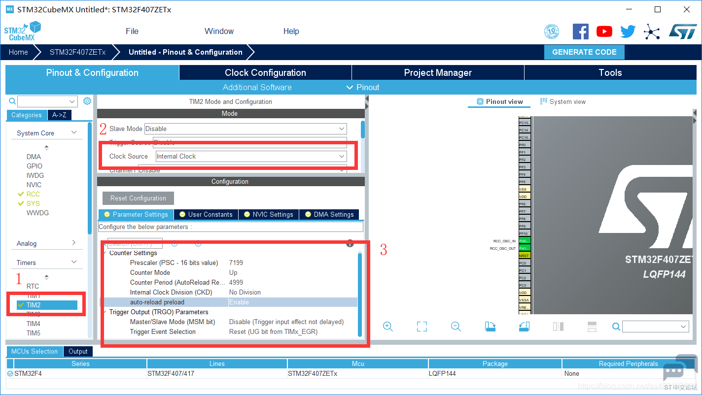

1.选择TIM2

2.定时器时钟选择内部时钟

Clock Source(时钟来源)      
选项1 ：Internal Clock  内部时钟
选项2 ： ETR2 外部触发输入(ETR)(仅适用TIM2,3,4)

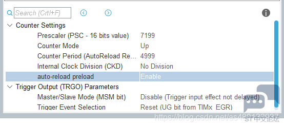
Prtscaler (定时器分频系数)  : 7199

Counter Mode(计数模式)    Up(向上计数模式)                    

Counter Period(自动重装载值) :    4999     

CKD(时钟分频因子) ：       No Division 不分频

选项：  可以选择二分频和四分频                        

auto-reload-preload(自动重装载)  :    Enable 使能

TRGO Parameters    触发输出 (TRGO)               不使能    与本节无关，之后做详细介绍

TRGO：    定时器的触发信号输出  在定时器的定时时间到达的时候输出一个信号(如：定时器更新产生TRGO信号来触发ADC的同步转换，)

这两个为定时器主从模式配置，很少用到，我们用不到，所以全部关闭

使能定时器中断：
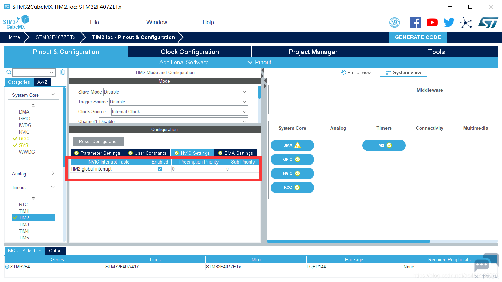
定时器溢出时间：

这里我们 arr=4999  psc=7199 Tclk=72Mhz        Tout = (5000*7200)/72  us  = 500ms

4项目文件设置
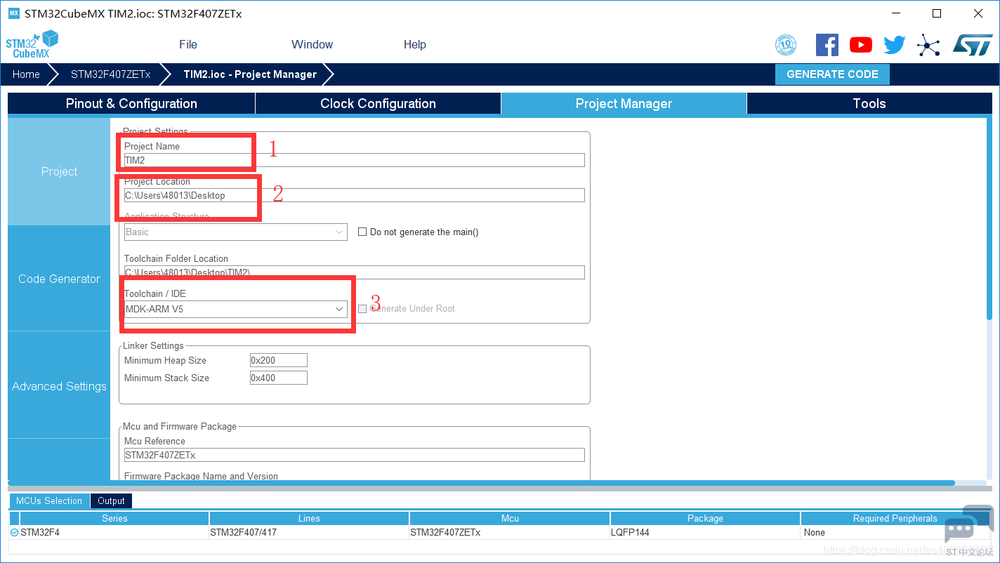
1 设置项目名称
2 设置存储路径
3 选择所用IDE
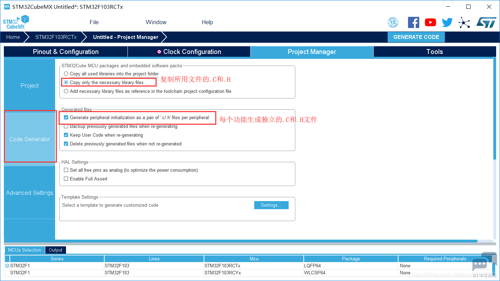
5创建工程文件

然后点击GENERATE CODE  创建工程

配置下载工具
新建的工程所有配置都是默认的  我们需要自行选择下载模式，勾选上下载后复位运行
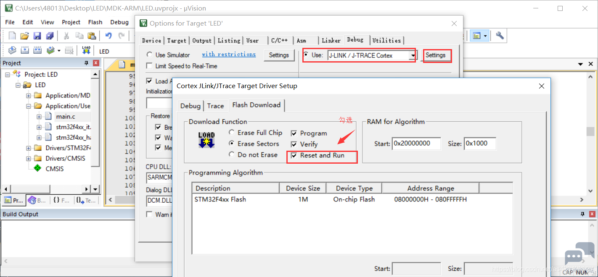
函数讲解：
```
HAL_TIM_IRQHandler(&htim2);
```

定时器中断处理函数   在stm32f4xx_it.c的 TIM2_IRQHandler()定时器中断服务函数中

这个函数的具体作用是判断中断是否正常，然后判断产生的是哪一类定时器中断(溢出中断/PWM中断.....)，然后进入相应的中断回调函数
```void HAL_TIM_PeriodElapsedCallback(TIM_HandleTypeDef *htim)```


在HAL库中，每进行完一个中断，并不会立刻退出，而是会进入到中断回调函数中，

这里我们是使用定时器溢出中断回调函数

void TIM3_IRQHandler(void)   首先进入中断函数
HAL_TIM_IRQHandler(&htim2);之后进入定时器中断处理函数
判断产生的是哪一类定时器中断(溢出中断/PWM中断.....) 和定时器通道
void HAL_TIM_PeriodElapsedCallback(&htim2);    进入相对应中断回调函数
在中断回调函数中添加用户代码

你也可以在在stm32f1xx_it.c中找到中断回调函数

     __weak void HAL_TIM_PeriodElapsedCallback(TIM_HandleTypeDef *htim)  

例程：
定时器溢出时间为500ms，LED点亮延时500ms闪烁
在main.c主函数上方初始化使能定时器2
```  /* USER CODE BEGIN 2 */
    /*使能定时器1中断*/
    HAL_TIM_Base_Start_IT(&htim2);
  /* USER CODE END 2 */```


在main.c主函数下方添加中断回调函数
```void HAL_TIM_PeriodElapsedCallback(TIM_HandleTypeDef *htim)
{
    static unsigned char ledState = 0;
    if (htim == (&htim2))
    {
        if (ledState == 0)
            HAL_GPIO_WritePin(GPIOE,GPIO_PIN_15,GPIO_PIN_RESET);
        else
            HAL_GPIO_WritePin(GPIOE,GPIO_PIN_15,GPIO_PIN_SET);
        ledState = !ledState;
    }
}```